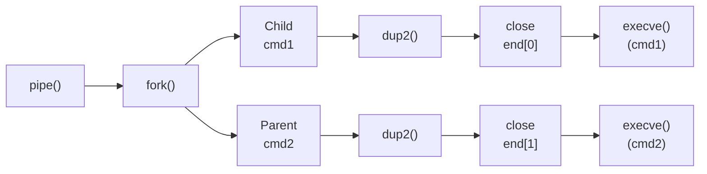

# Pipex

Pipex is a program that simulates the pipe functionality in shell commands, allowing users to redirect the output of one command as input to another.

### Installation

Once you have the repository cloned, navigate to the project directory and compile the program using the make command:

```go
cd pipex
make
```

This will compile the executable: `pipex`

---

<br />


### Usage

The basic usage of Pipex is as follows:

```bash
./pipex test_files/infile cmd1 cmd2 test_files/outfile
```

This will execute the two commands `cmd1` and `cmd2` with the input from `infile` and output to `outfile`. The output of `cmd1` will be used as input for `cmd2`. 

---

<br />


### Examples

Here are some examples of how to use Pipex:

```bash
# Count occurances of "Hamlet"
./pipex test_files/infile "grep Hamlet" "wc" test_files/outfile

# Create outfile
./pipex test_files/infile "grep Hamlet" "wc" NEW_OUTFILE
```

This will execute the commands `grep Hamlet` and `wc` with the input from `test_files/infile` and output to `test_files/outfile`. The output of `grep` `test_files/infile` will be used as input for `wc`, and written to `test_files/outfile`, which is created if it does not exist.

Examples of errors include:

```bash
# Invalid number of arguments
./pipex 1 2 3

# Invalid infile
./pipex INVALID_FILE "grep Hamlet" "wc" test_files/outfile

# Invalid command
./pipex test_files/infile "INVALID COMMAND" "wc" test_files/outfile
```

---

<br />


# About the program




---

<br />
