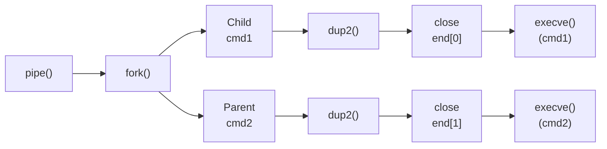

# Pipex

Pipex is a program that simulates the pipe functionality in shell commands, allowing users to redirect the output of one command as input to another.

### Installation

Once you have the repository cloned, navigate to the project directory and compile the program using the make command:

```go
cd pipex
make
```

This will compile the executable: pipex

---

<br />


### Usage

The basic usage of Pipex is as follows:

```bash
./pipex test_files/infile cmd1 cmd2 test_files/outfile
```

This will execute the two commands cmd1 and cmd2 with the input from infile and output to outfile. The output of cmd1 will be used as input for cmd2.

---

<br />


### Examples

Here are some examples of how to use Pipex:

```bash
./pipex test_files/infile cat grep hello test_files/outfile
```

This will execute the commands cat file1 and grep hello with the input from file1 and output to file2. The output of cat file1 will be used as input for grep hello.

```bash
./pipex test_files/infile "grep hello" "wc -w" test_files/outfile
```

This will execute the commands grep hello and wc -w with the input from file1 and output to file2. The output of grep hello will be used as input for wc -w, and the here document will simulate input from the user.

---

<br />


# About the program



```mermaid
graph LR
A["pipe()"] -->B["fork()"]
    B  --> C1["Child\ncmd1"]
	C1 --> C2["dup2()"]
    C2 --> C3["close\nend[0]"]
    C3 --> C4["execve()\n(cmd1)"]
    B  --> P1["Parent\ncmd2"]
    P1 --> P2["dup2()"]
    P2 --> P3["close\nend[1]"]
    P3 --> P4["execve()\n(cmd2)"]
```

---

<br />
